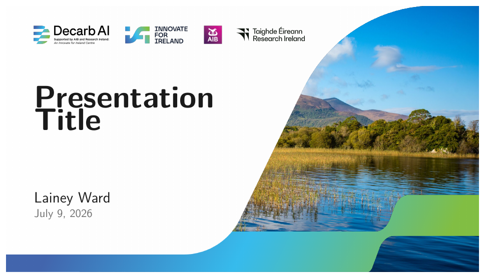
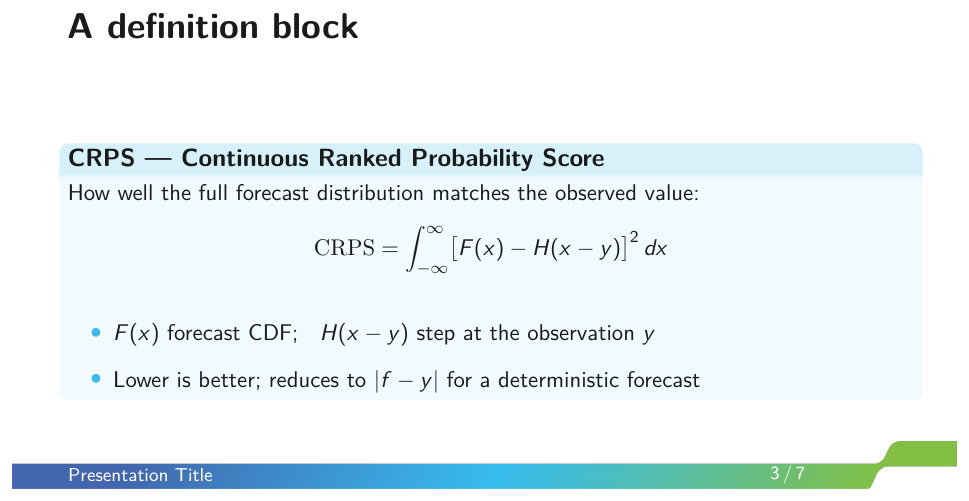
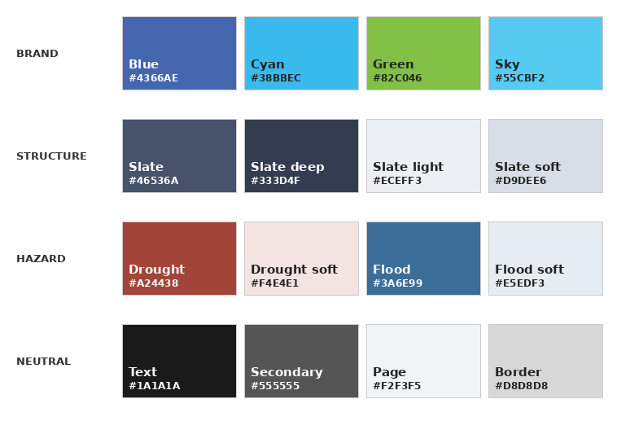

# Decarb-AI templates

Decarb-AI house-style templates for research communication. Currently the LaTeX
Beamer **slide** template below; an HTML **poster** template is in progress. The
shared brand [palette](PALETTE.md) is at the repo root.

## Slide template

A LaTeX Beamer slide template in the Decarb-AI house style, for talks given
under the Innovate for Ireland Programme.

Decarb-AI is an Innovate for Ireland centre working on AI for decarbonising
Ireland, jointly funded by Taighde Éireann – Research Ireland and AIB. This
template adapts the official Decarb-AI PowerPoint and branding pack into
Beamer, so slides can be written in LaTeX (equations, figures, references)
while keeping the official look. Adapted for easier use.

| Title slide | Definition / equation slide |
|:---:|:---:|
|  |  |

## Tech stack

LaTeX Beamer (16:9) with TikZ. Latin Modern fonts. Compiles with standard
pdfLaTeX (LuaLaTeX and XeLaTeX also work). No special engine needed, so it runs
on Overleaf's default compiler as-is.

## Getting started

1. Add the brand assets to `assets/` (see [`assets/README.md`](assets/README.md)).
   They are not shipped with this repo (Decarb-AI copyright). Decarb-AI members
   can get the ready-to-use version, with the assets already in place, as a
   private Overleaf template (reach out for access), or take the assets from the
   official Decarb-AI branding pack.
2. Compile with pdfLaTeX:
   ```bash
   latexmk -pdf main.tex
   ```
3. Edit `main.tex`: set `\title`, `\author`, `\date`. Swap the cover photo with
   one line: `\renewcommand{\titlephoto}{assets/your-photo.jpg}`.

## What's included

- **Title slide** with logos, title/author/date, and a cover photo masked to the brand curve
- **Content slides** with a bold headline, spaced bullets, and a swoosh footer showing the name and `x/total` page number
- **Definition/equation block**, a tinted panel for a key equation
- **Conclusions**, a closing slide set apart by a faint wash with the funders repeated (no "thank you" slide)
- **References** with hanging indents that break across pages for long lists
- **Acknowledgement** and **backup/appendix** slides

## Project structure

```
beamerthemedecarb.sty   the theme (palette, layouts, title/conclusions/footer)
main.tex                example deck you edit
assets/                 brand assets (gitignored; see assets/README.md)
docs/                   README example images
```

## Licence

Template code: MIT (see [`LICENSE`](LICENSE)). The Decarb-AI brand assets are
excluded and remain the property of Decarb-AI / Research Ireland / AIB.

## Palette

The shared Decarb-AI colour palette is in [`PALETTE.md`](PALETTE.md) (brand,
structure, hazard, and neutral roles, with a drop-in CSS block) and
[`palette_swatch.png`](palette_swatch.png) as a visual reference.


